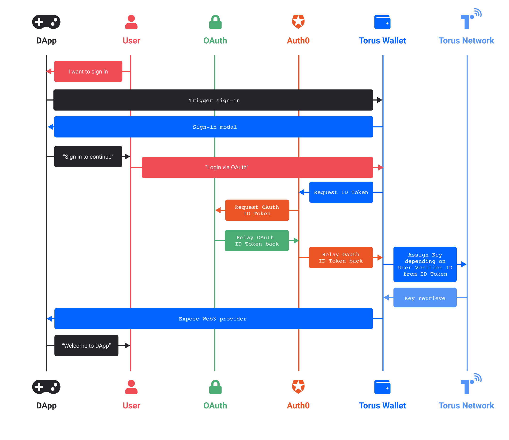

Proxy verifiers differ from a
[standard verifier or 3rd party OAuth2 logins](logins-key-assignments-and-retrievals.md)
as they depend on a proxy inbetween the Torus Network and the third party
\(Google\)

This is often a login service provider such as Auth0, AWS Cognito, or Okta, and
the login flow differentiates as below:

This causes these logins to have an additional trust assumption with the proxy
as well, on top of the original flow. For integrations involving a proxy, we
highly recommend DApps to inform users a third**-**party authenticator is
present by including the line “_Note: The following sign-in involves a third
party authenticator: \(list the logins\) Linkedin, Twitter_. etc”
