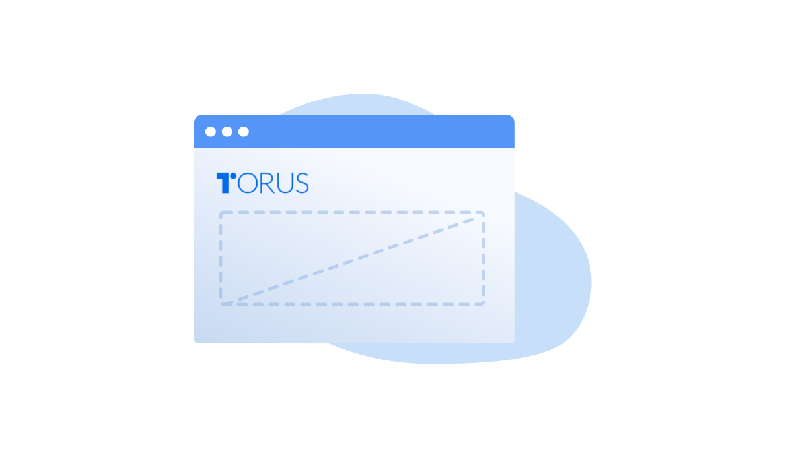
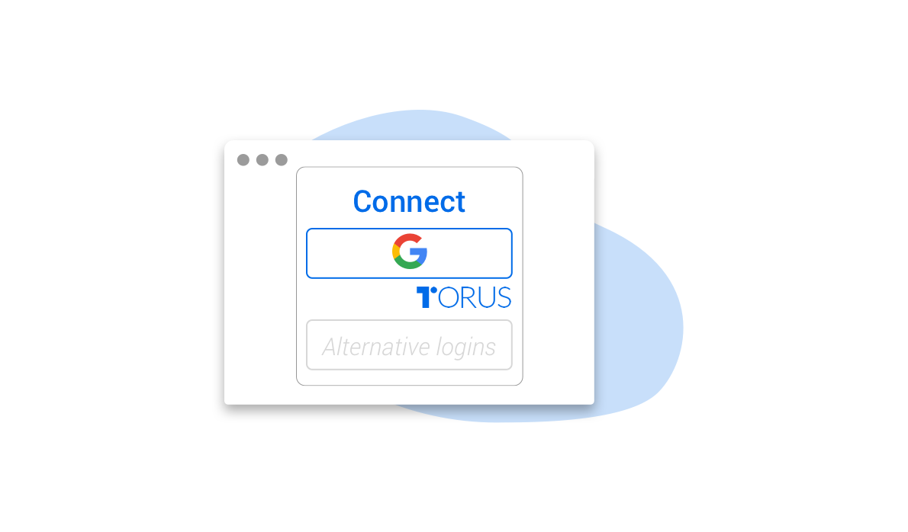

---

title: Getting Started
sidebar_label: Getting Started

---

We promise to keep things simple. Users can sign in to their Torus wallet in 3
simple steps.
---

# Getting Started

## Method A : Sign in via Torus Wallet user site

### Step 1 : Visit [Torus Wallet](https://app.tor.us) user site

### Step 2 : Sign in with your preferred social login

Example of social logins: Google, Facebook, Telegram, etc

Note: Ensure you enable Pop-up in order to continue with the sign in process

### Step 3 : DONE ! Enjoy the features of your Torus Wallet

You can now top up your wallet and carry out transfer to your friends.

## Method B : Sign in via DApp

DApp is an abbreviated form for Decentralized Application. They work just like an App from the App Store, but on the decentralised system.

### Step 1 : Visit a DApp and look out for Torus logo

It will be shown either as "TORUS" or a "T"

Note: This experience is only available for DApps that have integrated Torus.

Users can try it on the following **shortlisted DApps** that better illustrate the seamless login experience.

* [gDAI - Gasless DAI](https://gdai.io/)
* [1inchexchange - Aggregated Token Swap](https://1inch.exchange/#/)

### Step 2 : Sign in with your preferred social login

Example of social logins: Google, Facebook, Telegram, etc

Note: Ensure you enable Pop-up in order to continue with the sign in process

### Step 3 : DONE ! Enjoy the features of your Torus Wallet

You can now top up your wallet and carry out transfer to your friends.

